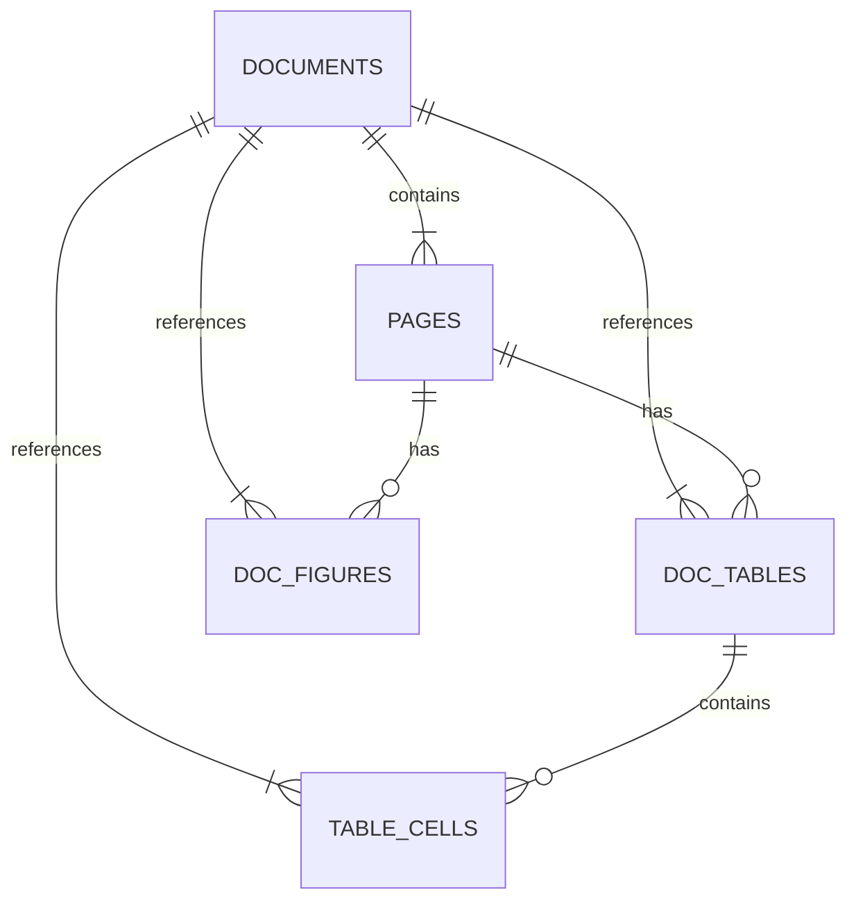

# Database Schema Design

이 프로젝트는 ESG 보고서 PDF 추출 데이터(구조화 텍스트, 표, 그림, 검증 결과)를 MySQL에 저장하여
검색과 분석 유연성을 확보하는 것을 목표로 합니다.

## ER Diagram Concept


## 구조도 (ASCII)

```
documents (1) ──┬── (N) pages
                │
                ├── (N) doc_tables ──── (N) table_cells
                │
                └── (N) doc_figures

pages (1) ──┬── (N) doc_tables
            │
            └── (N) doc_figures

doc_tables (1) ──── (N) table_cells
```

## Tables Definition

### 1. `documents`
문서 단위 메타데이터 및 보고서 정보.

| Field | Type | Constraints | Description |
|---|---|---|---|
| `id` | INT | PK, AUTO_INCREMENT | 문서 고유 ID |
| `filename` | VARCHAR(255) | UNIQUE, NOT NULL | 파일명 (예: `2025_HDEC_Report.pdf`) |
| `company_name` | VARCHAR(100) | INDEX | 회사명 (예: `현대건설`) |
| `report_year` | INT | INDEX | 보고서 연도 (예: `2023`) |
| `file_hash` | VARCHAR(64) | UNIQUE | SHA-256 해시 (중복 업로드 방지) |
| `total_pages` | INT | | 전체 페이지 수 |
| `created_at` | TIMESTAMP | DEFAULT CURRENT_TIMESTAMP | 생성 시각 |

**Indexes:**
```sql
CREATE INDEX idx_company_year ON documents(company_name, report_year);
CREATE INDEX idx_file_hash ON documents(file_hash);
```

---

### 2. `pages`
페이지 단위 데이터. 원문(Markdown)과 시각적 복잡도 저장.

| Field | Type | Constraints | Description |
|---|---|---|---|
| `id` | INT | PK, AUTO_INCREMENT | 페이지 고유 ID |
| `doc_id` | INT | FK → `documents.id`, NOT NULL | 문서 참조 |
| `page_no` | INT | NOT NULL | 페이지 번호 (1-based) |
| `visual_density` | FLOAT | DEFAULT 0.0 | 표+그림 면적 비율 (0.0~1.0) |
| `has_tables` | BOOLEAN | DEFAULT FALSE | 표 포함 여부 |
| `has_figures` | BOOLEAN | DEFAULT FALSE | 그림 포함 여부 |
| `needs_review` | BOOLEAN | DEFAULT FALSE | 수동 검수 필요 여부 |
| `full_markdown` | LONGTEXT | | Docling 추출 마크다운 전체 텍스트 (벡터DB용) |
| `image_path` | VARCHAR(255) | | 페이지 이미지 경로 (예: `/images/page_001.png`) |

**Indexes:**
```sql
CREATE UNIQUE INDEX idx_doc_page ON pages(doc_id, page_no);
```

---

### 3. `doc_tables`
표 메타데이터 및 검증(OCR/Diff) 결과.

| Field | Type | Constraints | Description |
|---|---|---|---|
| `id` | INT | PK, AUTO_INCREMENT | 표 고유 ID |
| `page_id` | INT | FK → `pages.id`, NOT NULL | 페이지 참조 |
| `doc_id` | INT | FK → `documents.id`, NOT NULL | 문서 참조 (빠른 필터링용) |
| `page_no` | INT | NOT NULL | 페이지 번호 (1-based) |
| `table_index` | INT | NOT NULL | 페이지 내 표 순서 (1, 2, 3...) |
| `title` | VARCHAR(500) | | 표 제목 또는 캡션 |
| `bbox_json` | JSON | | 표 전체 좌표 `{"left": x, "top": y, "right": x, "bottom": y}` |
| `diff_data` | JSON | | Difflib 검증 결과 (`*.diff.json` 내용) |
| `image_path` | VARCHAR(255) | | 표 이미지 경로 (예: `/tables/table_001.png`) |

**Indexes:**
```sql
CREATE INDEX idx_table_doc ON doc_tables(doc_id);
CREATE INDEX idx_table_page ON doc_tables(page_id);
CREATE INDEX idx_table_doc_page ON doc_tables(doc_id, page_no);
CREATE UNIQUE INDEX idx_page_table ON doc_tables(page_id, table_index);
```

---

### 4. `table_cells`
표 구조화 상세 데이터 (셀 단위).

| Field | Type | Constraints | Description |
|---|---|---|---|
| `id` | BIGINT | PK, AUTO_INCREMENT | 셀 고유 ID |
| `table_id` | INT | FK → `doc_tables.id`, NOT NULL | 표 참조 |
| `doc_id` | INT | FK → `documents.id`, NOT NULL | 문서 참조 (빠른 필터링용) |
| `row_idx` | INT | NOT NULL | 행 인덱스 (0-based) |
| `col_idx` | INT | NOT NULL | 열 인덱스 (0-based) |
| `content` | TEXT | | 셀 텍스트 내용 (예: `1,234 tCO2eq`) |
| `content_type` | ENUM('text', 'number', 'date') | DEFAULT 'text' | 내용 유형 |
| `numeric_value` | DECIMAL(20, 4) | NULL | 파싱된 숫자 값 (예: `1234.0`) |
| `unit` | VARCHAR(50) | NULL | 단위 (예: `tCO2eq`, `%`, `kWh`) |
| `row_span` | INT | DEFAULT 1 | 행 병합 개수 |
| `col_span` | INT | DEFAULT 1 | 열 병합 개수 |
| `is_header` | BOOLEAN | DEFAULT FALSE | 헤더 셀 여부 |
| `bbox_json` | JSON | | 셀 좌표 `{"left": x, "top": y, "right": x, "bottom": y}` |

**Indexes:**
```sql
CREATE INDEX idx_cell_table ON table_cells(table_id);
CREATE INDEX idx_cell_doc ON table_cells(doc_id);
CREATE INDEX idx_cell_position ON table_cells(doc_id, row_idx, col_idx);
CREATE INDEX idx_cell_numeric ON table_cells(numeric_value) WHERE content_type = 'number';
```

---

### 5. `doc_figures`
그림/도표 메타데이터 및 설명.

| Field | Type | Constraints | Description |
|---|---|---|---|
| `id` | INT | PK, AUTO_INCREMENT | 그림 고유 ID |
| `page_id` | INT | FK → `pages.id`, NOT NULL | 페이지 참조 |
| `doc_id` | INT | FK → `documents.id`, NOT NULL | 문서 참조 (빠른 필터링용) |
| `page_no` | INT | NOT NULL | 페이지 번호 (1-based) |
| `figure_type` | VARCHAR(50) | | 그림 유형 (예: `chart`, `diagram`, `photo`) |
| `caption` | TEXT | | 추출된 캡션 |
| `description` | TEXT | | GPT 생성 설명 (`*.desc.md` 내용) |
| `image_path` | VARCHAR(255) | | 이미지 파일 경로 (예: `/figures/figure_001.png`) |
| `bbox_json` | JSON | | 그림 좌표 `{"left": x, "top": y, "right": x, "bottom": y}` |

**Indexes:**
```sql
CREATE INDEX idx_figure_doc ON doc_figures(doc_id);
CREATE INDEX idx_figure_page ON doc_figures(page_id);
CREATE INDEX idx_figure_doc_page ON doc_figures(doc_id, page_no);
```

---

## Key Design Decisions

### 1. **doc_id 중복 저장 (반정규화)**
- `doc_tables`, `table_cells`, `doc_figures` 모두 `doc_id` 포함
- **목적**: 문서 단위 필터링 시 다중 조인 불필요
- **트레이드오프**: 저장 공간 소량 증가 vs 쿼리 성능 대폭 향상

### 2. **숫자 파싱 필드 분리**
- `table_cells.content`: 원본 텍스트 (예: `"1,234 tCO2eq"`)
- `numeric_value`: 파싱된 숫자 (예: `1234.0`)
- `unit`: 단위 (예: `"tCO2eq"`)
- **목적**: 숫자 기반 집계/비교 쿼리 최적화

### 3. **좌표 정보 유지 (bbox_json)**
- 모든 표, 셀, 그림에 좌표 저장
- **목적**: 
  - 원본 PDF 검증 가능
  - 향후 PDF 하이라이팅 기능 구현
  - OCR 오류 디버깅

### 4. **벡터 검색과 RDB 역할 분담**
- **벡터DB**: `pages.full_markdown`, `doc_tables.title`, `doc_figures.caption` 임베딩
- **RDB**: 정확한 숫자, 표 구조, 좌표 정보 저장
- **RAG 플로우**: 벡터 검색 → 관련 문서/페이지 발견 → RDB에서 정밀 추출

---

## Sample Queries

### 1. 특정 회사의 연도별 보고서 조회
```sql
SELECT id, filename, report_year, total_pages
FROM documents
WHERE company_name = '삼성전자'
ORDER BY report_year DESC;
```

### 2. 특정 페이지의 모든 표와 그림 가져오기
```sql
-- 표
SELECT * FROM doc_tables WHERE page_id = 123;

-- 그림
SELECT * FROM doc_figures WHERE page_id = 123;
```

### 3. 특정 표의 모든 셀 조회 (구조 복원)
```sql
SELECT row_idx, col_idx, content, is_header, bbox_json
FROM table_cells
WHERE table_id = 456
ORDER BY row_idx, col_idx;
```

### 4. 숫자 기반 검색 (Scope 1 배출량 1000 이상)
```sql
SELECT 
    d.company_name,
    d.report_year,
    tc.content,
    tc.numeric_value,
    tc.unit
FROM table_cells tc
JOIN documents d ON tc.doc_id = d.id
WHERE tc.content LIKE '%Scope 1%'
  AND tc.numeric_value >= 1000
  AND tc.unit = 'tCO2eq';
```

### 5. 낮은 OCR 신뢰도 표 찾기
```sql
SELECT 
    d.filename,
    p.page_no,
    dt.title,
    dt.ocr_confidence
FROM doc_tables dt
JOIN pages p ON dt.page_id = p.id
JOIN documents d ON dt.doc_id = d.id
WHERE dt.ocr_confidence < 0.8
ORDER BY dt.ocr_confidence ASC;
```

---

## Migration Notes

### From Old Schema:
1. `scanned_at` → `created_at` (동일 의미)
2. `table_seq_id` → `table_index` (INT 타입으로 변경)
3. `figure_seq_id` 제거 (순서는 자동 생성 ID로 대체)
4. `ocr_data` 제거 (`diff_data`만 유지)
5. `pages.summary` 제거 (벡터DB에서 처리)

### Update Strategy:
- **UPSERT 로직**: `(doc_id, page_no)` 또는 `filename` 기반
- 재실행 시 중복 방지: `file_hash` 체크
- 점진적 마이그레이션: 기존 데이터는 NULL 허용 후 점진적 업데이트

---

## Database Requirements

- **MySQL 8.0+** (JSON, INDEX on computed columns 지원)
- **Character Set**: `utf8mb4` (한글, 이모지 지원)
- **Collation**: `utf8mb4_unicode_ci`

```sql
CREATE DATABASE esg_reports
CHARACTER SET utf8mb4
COLLATE utf8mb4_unicode_ci;
```
