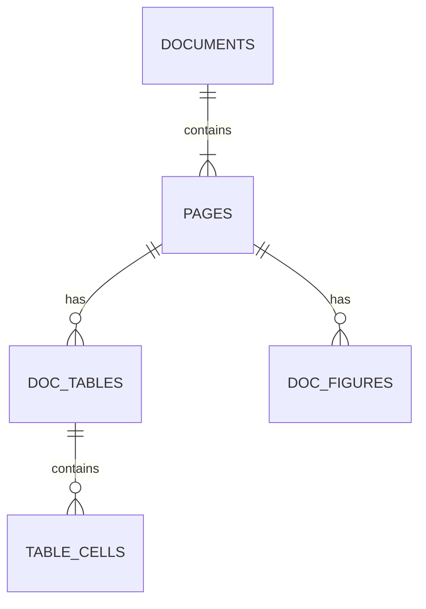

# Database Schema Design

이 프로젝트는 PDF 추출 데이터(구조화 텍스트, 표, 그림, 검증 결과)를 MySQL에 저장하여
검색과 분석 유연성을 확보하는 것을 목표로 합니다.

## ER Diagram Concept

## Tables Definition

### 1. `documents`
문서 단위 메타데이터.
| Field | Type | Description |
|---|---|---|
| `id` | INT (PK) | Auto Increment |
| `filename` | VARCHAR(255) | Unique File Name |
| `scanned_at` | TIMESTAMP | Created Time |

### 2. `pages`
페이지 단위 데이터. 원문(Markdown)과 요약문, 시각적 복잡도를 저장.
| Field | Type | Description |
|---|---|---|
| `id` | INT (PK) | Auto Increment |
| `doc_id` | INT (FK) | Reference `documents.id` |
| `page_no` | INT | Page Number (1-based) |
| `full_markdown` | LONGTEXT | Docling Extracted Markdown (Full Text) |
| `summary` | TEXT | GPT Summary (Step 1 or 5) |
| `visual_density` | FLOAT | Table+Figure Area Ratio |
| `needs_review` | BOOLEAN | If True, requires visual check |

### 3. `doc_tables`
표 메타데이터 및 검증(OCR/Diff) 결과.
| Field | Type | Description |
|---|---|---|
| `id` | INT (PK) | Auto Increment |
| `page_id` | INT (FK) | Reference `pages.id` |
| `table_seq_id` | VARCHAR(50) | e.g., `table_001` |
| `title` | VARCHAR(500) | Detected Title |
| `bbox_json` | JSON | `[left, top, right, bottom]` |
| `ocr_data` | JSON | Content of `*.ocr.json` (RapidOCR Result) |
| `diff_data` | JSON | Content of `*.diff.json` (Validation Result) |

### 4. `table_cells`
표 구조화 상세 데이터 (Docling Result).
| Field | Type | Description |
|---|---|---|
| `id` | BIGINT (PK) | Auto Increment |
| `table_id` | INT (FK) | Reference `doc_tables.id` |
| `row_idx` | INT | 0-based Row Index |
| `col_idx` | INT | 0-based Col Index |
| `content` | TEXT | Cell Text Value |
| `row_span` | INT | Default 1 |
| `col_span` | INT | Default 1 |
| `is_header` | BOOLEAN | Header Flag |

### 5. `doc_figures` (New)
그림/도표 메타데이터 및 GPT 설명.
| Field | Type | Description |
|---|---|---|
| `id` | INT (PK) | Auto Increment |
| `page_id` | INT (FK) | Reference `pages.id` |
| `figure_seq_id` | VARCHAR(50) | e.g., `figure_001` |
| `bbox_json` | JSON | `[left, top, right, bottom]` |
| `caption` | TEXT | Extracted Caption |
| `description` | TEXT | GPT Description (from `*.desc.md`) |
| `image_path` | VARCHAR(255) | Relative path to PNG |

## Notes
- **JSON Columns**: MySQL 5.7+ / 8.0+ supports native JSON.
- **Update Strategy**: The loading script performs `UPSERT` (Insert on duplicate update) logic based on `(doc_id, page_no)` or filenames to allow re-running steps without duplicate data.
